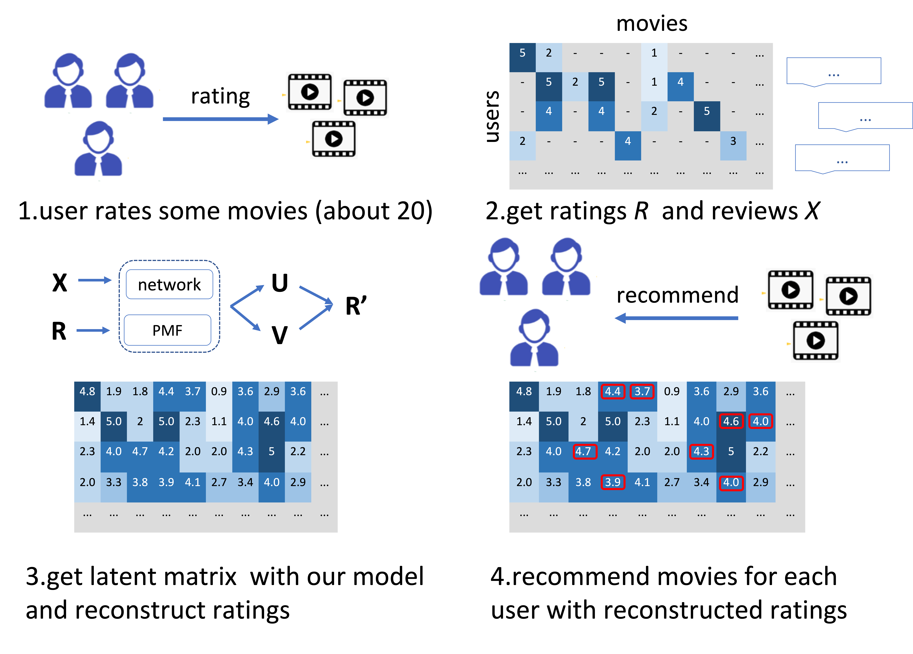

# DeepMovie

### Brief Introduction

Official implementation of the AI3602 course project **DeepMovie** developed by Group 6 **Gold Miners**. It is a plug-and-play deep nueral network training pipeline turning most deep learning base modules into a movie recommender system.

&nbsp;&nbsp;&nbsp;&nbsp;&nbsp;&nbsp;&nbsp;&nbsp;&nbsp;&nbsp;

The brief process of DeepMovie can be summarized as the following graph:

&nbsp;&nbsp;&nbsp;&nbsp;&nbsp;&nbsp;&nbsp;&nbsp;&nbsp;&nbsp;

### Prepare Datasets

MovieLens-1M and 10M datasets can be downloaded from [MovieLens](https://files.grouplens.org/datasets/movielens/). Please put your dataset under the `data` folder along with `ml_plot.dat`.

### Data Preprocessing

```bash
python data_preprocess.py 
```

### DNN Training and Evaluating 

```bash
python train_evaluate.py 
```

### Quantitative Results (in RMSE)

| model | movielens-1m | movielens-10m |
|-------|--------------|---------------|
| PMF(baseline)           |   0.8971   |   0.8311   |
| CNN           |   0.8733   |   0.7970   |
| CNN_KAN       |   0.8725   |   0.7941   |
| LSTM          |   0.8675   |   0.7959   |
| ResNet        |   0.8658   |   0.7931   |
| Transformer   | __0.8601__ | __0.7883__ |

## Contact Us
**Jiazi Bu**: [bujiazi001@sjtu.edu.cn](mailto:bujiazi@sjtu.edu.cn)  
**Zhiyuan Zhang**: [zhangzhiyuanzzy@sjtu.edu.cn](mailto:zhangzhiyuanzzy@sjtu.edu.cn)  
**Xizhuo Zhang**: [nczhang99@sjtu.edu.cn](mailto:nczhang99@sjtu.edu.cn)
